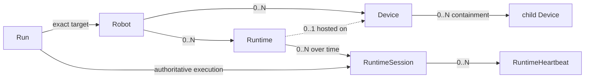

# Robot / Device / Runtime 拆分合同

- 状态：`Contract frozen / Local implementation draft not accepted`
- 决策日期：2026-08-06
- 作用范围：Platform 身份注册、Runtime session、管理面 Heartbeat，以及未来 Run 引用
- 证据边界：本合同只冻结对象语义；工作区存在未重新验证的实现草案，但不构成合同验收或跨仓接入证据
- D2/D3 结果：[Management Plane v2 一致性审阅](MANAGEMENT_PLANE_V2_CONFORMANCE_REVIEW.md) 已冻结目标语义；D2 已实施待 Go 验证，D3 当前代码一致性仍为 Fail

## 1. 决策摘要

本合同把当前 `Device` 混合对象拆成三个不同寿命、不同权威的对象：

| 对象 | 一句话定义 | 身份跨什么保持稳定 | 不是什么 |
|---|---|---|---|
| Robot | 可接受领域 Task 的 physical 或 simulation 机器人资产 | Runtime 重启、软件升级、Device 固件升级 | 不是进程、ROS node、仓库或 Dashboard card |
| Device | 从属于一台 Robot 的硬件或仿真设备端点 | Runtime 重启和普通固件升级 | 不是 Robot 本身，也不是 MQTT topic、CAN frame 或 bridge process |
| Runtime | 部署到一台 Robot、需要被独立管理和观测的软件实例 | 同一部署实例的进程重启和版本升级 | 不是一次进程启动、代码仓库或每个 ROS node |

一次 Runtime 进程启动由从属对象 `RuntimeSession` 表示。Heartbeat 属于 RuntimeSession，不属于 Robot 或 Device：

> `runtime_id` 标识稳定的受管软件实例；`session_id` 标识一次进程启动；Heartbeat 的顺序和活性只在 `runtime_id + session_id` 内成立。

这项拆分只解决身份、寿命和管理面活性，不扩展 Task、Fault、Alert、Version 或 Artifact 的完整模型。

## 2. 为什么当前模型不能继续扩展

当前 Phase 1 原型把以下语义压入同一个 `Device`：

| 当前字段或关系 | 当前承载的混合语义 | 目标归属 |
|---|---|---|
| `devices.kind = panda/amr/dev` | Robot domain、Robot 类型和 Device 类型 | Robot `domain`；Device 使用独立的 `device_class` |
| `devices.version` | Robot 软件、Runtime build 或 firmware 无法区分 | Version 记录及其明确绑定 |
| `devices.heartbeat_interval_ms` | 把硬件身份当成管理面进程 | Runtime 的管理面 heartbeat policy |
| `heartbeats.device_id` | 无法区分 CAN NodeHeartbeat 与服务进程 Heartbeat | RuntimeSession Heartbeat |
| `devices.status` | 混合 Runtime liveness、Device condition 和 Robot readiness | 三种独立状态语义 |
| `runs.device_id` | 无法说明执行的是哪台 Robot、由哪个 Runtime/session 执行 | `run.robot_id` + authoritative `runtime_session_id` |
| `alerts.device_id` | 无法说明根因来自 Device、Runtime 还是 Domain | 后续 Fault source contract |

当前 demo 中的 `panda-sim` 和 `amr-sim` 实际更像 Robot，却通过 `/v1/devices` 创建；它们的 Heartbeat 又更像 Runtime liveness。这些数据只能证明 Phase 1 HTTP/SQLite 合同可以运行，不能作为目标身份模型的迁移样本。

## 3. 身份寿命合同

### 3.1 Robot

Robot 是 Platform 的资产聚合根。它回答“这次任务作用于哪台机器人”，而不是“哪个进程在线”。

Robot 身份遵守以下规则：

- Platform canonical `robot_id` 一经创建不可复用；display name 可以修改，但不是身份。
- Runtime 重启、Runtime 升级、Device firmware 升级不改变 `robot_id`。
- 更换某个传感器、MCU 或计算机只替换 Device，不创建新 Robot。
- physical Robot 被整体替换，或创建新的 simulation instance 时，必须创建新 `robot_id`。
- MuJoCo Panda 与 PyBullet Panda 是不同的 simulation Robot instance；它们可通过 artifact/domain provenance 关联，但不能共享同一个 `robot_id` 冒充同一执行实体。
- Robot 退役后保留历史引用，不硬删除、不把 ID 分配给另一台 Robot。

Robot 不保存当前 pose、map、URDF、关节、Task GT、控制模式或策略能力。这些字段需要领域语义，不属于全局 Registry。

### 3.2 Device

Device 是 Robot 下具有独立资产身份的硬件或仿真端点，例如 compute host、MCU、sensor、actuator 或 bus node。

Device 身份遵守以下规则：

- 每个 Device 必须从属于且只从属于一台 Robot。
- 同一物理 Device 的普通 firmware 升级不改变 `device_id`；固件版本通过 Version 绑定表达。
- 物理单元被替换时创建新 `device_id`，旧 Device 标记 retired 并保留历史。
- 可选 `parent_device_id` 只表达同一 Robot 内的静态 containment，不表达控制权、数据流或安全依赖。
- Device 不能直接向 Platform 建立控制闭环。
- MQTT topic、ROS topic、CAN frame、IP address 和进程 PID 不是 Device identity。
- 当前合同不登记被多台 Robot 共享的基础设施。未来出现共享相机、服务器或 Site 设备时，应单独设计 shared resource ownership，不能复制成多个 Device 或把 `robot_id` 改成含义不清的 nullable 字段。

Platform 可以登记粗粒度 Device class 和静态硬件身份，但不解释协议 payload、PID/PWM、量测值或设备恢复条件。

### 3.3 Runtime

Runtime 是部署到某台 Robot、需要独立登记和观测的一个软件实例。其粒度是“可独立部署、监督、升级并提供管理面身份的实例”，不是把所有进程或 ROS node 都登记到 Platform。

Runtime 身份遵守以下规则：

- 每个 Runtime 必须从属于且只从属于一台 Robot。
- 同一部署实例的进程重启保持 `runtime_id`，并创建新 `session_id`。
- 同一部署实例的软件升级保持 `runtime_id`，新 session 绑定新的 Version。
- Runtime 被迁移成另一个独立部署实例或替换其安装槽时，创建新 `runtime_id` 并 retire 旧记录。
- 同一个 `runtime_id` 最多有一个 current session；需要并发副本时，每个副本拥有独立 `runtime_id`。
- 可选 `host_device_id` 指向这台 Robot 下的 compute Device；未登记 host 时保持为空，不能伪造 Device。
- repository、binary artifact 和 systemd unit name 可用于 provenance，但它们本身不是 Runtime。

Platform 不登记 Runtime 内部线程、fd、watchdog、state machine、deadline 或 worker health。它只登记实例身份和低频管理面投影。

### 3.4 RuntimeSession

RuntimeSession 是一次具体进程执行的不可复用代次，解决“Runtime 身份需要稳定”与“Heartbeat seq 在重启后需要重新开始”的冲突。

- `session_id` 由 Runtime producer 在每次进程启动时生成，必须在该 `runtime_id` 下唯一。
- session start 记录该次执行使用的 Version；Version 在 session 生命周期内不可变。
- 正常退出可以报告 end；异常退出或网络隔离可能没有 end event。
- 同一 Runtime 的新 session 出现时，旧 session 变成 superseded；旧 session 的迟到事件只保留审计，不能恢复 current liveness。
- RuntimeSession 不是新的全局业务对象，不被 Dashboard 当成 Robot 或 Device 展示；它是 Runtime 历史和 Run provenance 的从属记录。

## 4. 目标关系和基数



强制不变量：

1. `device.robot_id` 与 `runtime.robot_id` 都不可为空。
2. `parent_device_id` 必须和 child Device 属于同一个 Robot，并且 containment 图必须无环。
3. `host_device_id` 如果存在，必须属于同一个 Robot；建议其 class 为 `compute`，但 Platform 不从 class 推断行为。
4. `runtime_session.runtime_id` 不可变；`session_id` 不可复用。
5. `heartbeat(runtime_id, session_id, seq)` 唯一，seq 只需在 session 内严格递增。
6. Run 引用的 Robot 必须和 authoritative RuntimeSession 所属 Robot 一致。
7. 被 Run、Fault、Version 或 Artifact Reference 引用的身份只能 retire，不能硬删除。
8. Robot、Device、Runtime 都不能用名称、repo、IP、topic 或 PID 充当 canonical ID。

当前范围不增加 Runtime 与 Device 的通用 many-to-many “controls/observes” 关系。Fault 或 evidence event 可以同时引用 RuntimeSession 和 Device；只有出现第二个真实且稳定的查询需求后，才评审持久化绑定表。

## 5. 逻辑字段合同

这些字段用于冻结语义，不是最终 JSON、SQL 或 API 设计。

### 5.1 Robot record

| 字段 | 要求 | 说明 |
|---|---|---|
| `robot_id` | required, immutable | Platform canonical opaque ID |
| `display_name` | required, mutable | 仅用于人类识别 |
| `domain` | required | `amr`、`panda` 等路由命名空间；Platform 不解析域 payload |
| `embodiment` | required | `physical` 或 `simulation`；不代表验证级别 |
| `lifecycle_state` | required | `active` 或 `retired`；不是在线状态 |
| `external_refs[]` | optional | namespaced domain identity 映射 |
| `created_at/updated_at` | server-owned | Platform wall-clock audit time |

Robot record 禁止出现 `heartbeat_interval`、`software_version`、`current_pose`、`task_success` 和 `ready`。

### 5.2 Device record

| 字段 | 要求 | 说明 |
|---|---|---|
| `device_id` | required, immutable | Platform canonical opaque ID |
| `robot_id` | required, immutable | Robot ownership |
| `parent_device_id` | optional | 仅表示 containment |
| `display_name` | required, mutable | 人类可读名称 |
| `device_class` | required | 粗粒度 class：`compute/controller/sensor/actuator/bus_node/composite` |
| `domain_type` | optional, opaque | 域内类型名；Platform 不据此执行逻辑 |
| `manufacturer/model/serial_number` | optional | 静态硬件身份；simulation Device 可为空 |
| `lifecycle_state` | required | `active` 或 `retired` |
| `external_refs[]` | optional | firmware/ROS/domain 侧的 namespaced identity |
| `created_at/updated_at` | server-owned | Platform audit time |

Device record 禁止出现管理面 `heartbeat_interval`、Runtime PID、CAN heartbeat seq、当前 sensor sample、motor command 和内嵌 firmware version。

### 5.3 Runtime record

| 字段 | 要求 | 说明 |
|---|---|---|
| `runtime_id` | required, immutable | Platform canonical opaque ID，预先配置给 producer |
| `robot_id` | required, immutable | 该实例服务的 Robot |
| `display_name` | required, mutable | 人类可读名称 |
| `runtime_role` | required | 粗粒度 role：`control_runtime/domain_executor/device_bridge/replay_executor` |
| `component` | required | 稳定组件名，例如 `rcrd`；不是 repo identity |
| `host_device_id` | optional | 部署所在 compute Device |
| `heartbeat_interval_ms` | required | 低频管理面期望周期，不影响本地 watchdog |
| `lifecycle_state` | required | `active` 或 `retired` |
| `external_refs[]` | optional | systemd/deployment/domain 的 namespaced identity |
| `created_at/updated_at` | server-owned | Platform audit time |

Runtime record 禁止出现 fd、thread、ROS node graph、CAN session、control state、OutputCommand 或内嵌 current Version。当前 Version 由 active RuntimeSession 投影得出。

### 5.4 RuntimeSession record

| 字段 | 要求 | 说明 |
|---|---|---|
| `session_id` | required, producer-generated | 每次进程启动生成，不可复用 |
| `runtime_id` | required, immutable | 所属 Runtime |
| `software_version_ref` | required | 该 session 的精确 build；producer 暂时无法提供时，必须引用显式的 `unknown` Version record，不能留空或猜测 |
| `started_at_reported` | optional | producer wall clock，仅用于审计 |
| `started_at_received` | server-owned | Platform 首次接收时间 |
| `ended_at_reported` | optional | 正常结束时可上报 |
| `ended_at_received` | optional, server-owned | Platform 接收结束事件时间 |
| `session_state` | server projection | `current/ended/superseded`；不是 Runtime 内部控制状态 |

### 5.5 External reference

外部 ID 必须使用 `{namespace, value}`，例如 `amr_wms.robot_id` 或 `ros2.node_fqn`。约束如下：

- canonical ID 与 external ref 分开；外部系统不能覆盖 Platform ID。
- 同一对象下 namespace 不重复；全局需要反查的 namespace/value 必须唯一。
- display name、repo URL、topic 名不能偷偷代替 external ref。
- 删除外部系统数据不会级联删除 Platform 身份和历史。

## 6. 三类状态必须分开

| 状态 | 正确语义 | 权威 | Platform 可否推断 |
|---|---|---|---|
| Robot lifecycle | active/retired 资产生命周期 | Platform Registry | 可以维护，但不是 readiness |
| Robot readiness / Task state | 是否可接收任务、任务执行到哪里 | Robot Domain | 不可从 Heartbeat 推断 |
| Device condition | healthy/degraded/faulted 等来源观测 | Device/Runtime source | 只保存 source-attributed projection |
| Runtime lifecycle | active/retired 登记状态 | Platform Registry | 可以维护 |
| Runtime liveness | unknown/online/stale/offline 管理面可见性 | Platform 按接收时间计算 | 可以，但不代表控制安全 |
| Runtime internal state | Idle/Active/Hold/Fault 等本地状态机 | Runtime | 不统一、不驱动 |

因此目标模型不提供一个跨三者通用的 `status` 字段。Dashboard 可以并排显示这些状态，但必须保留字段名和权威来源，不能合成一个未经定义的红/黄/绿真值。

## 7. Runtime Heartbeat 合同

### 7.1 管理面事件

Runtime 与 Platform 的最小事件序列是：

```text
Runtime 预先获得稳定 runtime_id
-> 进程启动，生成新 session_id
-> 上报 RuntimeSessionStarted(version, reported time)
-> 周期上报 RuntimeHeartbeat(session_id, seq, reported time)
-> 正常退出时可上报 RuntimeSessionEnded
-> 异常退出时由 Platform 根据 received time 变为 stale/offline
```

Heartbeat 的最小字段：

| 字段 | 生产者 | 语义 |
|---|---|---|
| `runtime_id` | Runtime config | 稳定实例身份 |
| `session_id` | Runtime process | 本次进程执行代次 |
| `seq` | Runtime process | session 内正整数严格递增；允许缺口 |
| `reported_at` | Runtime process | 可选 wall-clock 观测，不用于活性判定 |
| `received_at` | Platform | 服务端接收时间，唯一 liveness 时钟来源 |

### 7.2 接收和排序规则

- 同一个 `(runtime_id, session_id, seq)` 重复且 payload 相同，按幂等成功处理。
- 相同 key 但 payload 不同是 conflict，不能覆盖原记录。
- session 内 seq 回退被拒绝；新 session 允许从 1 重新开始。
- first heartbeat 不能把 retired Runtime 自动恢复 active。
- 新 session 成为 current 后，旧 session 的迟到 Heartbeat 只保留审计，不更新 Runtime current liveness。
- producer wall clock 可以漂移；未来时间、旧时间都不能延长 liveness。
- Platform 重启后从持久化的最新 `received_at` 恢复投影，不能依赖内存计时器作为唯一事实。

### 7.3 Liveness 规则

目标 Runtime liveness 使用 `unknown/online/stale/offline`：

| 条件 | Runtime liveness |
|---|---|
| active Runtime 从未建立 session 或 current session 尚无 Heartbeat | `unknown` |
| age <= stale threshold | `online` |
| stale threshold < age <= offline threshold | `stale` |
| age > offline threshold，或 session 明确结束 | `offline` |

阈值可沿用 Phase 1 的 `3 x interval` 与 `6 x interval` 作为首个实现策略，但名称和对象必须改变。阈值属于 Platform 运维策略，不改变 Runtime 本地 watchdog 或 Fault 规则。

### 7.4 与 CAN NodeHeartbeat 的硬边界

`robot-control-runtime` 中的 CAN NodeHeartbeat 是 Runtime 内部的 Device Supervision 输入：

- 它使用具体 CAN 协议的 node/session/seq 和相对时间规则；
- 它可能触发 CommLoss、Hold 或 Fault；
- 它不能逐帧转发成 Platform RuntimeHeartbeat；
- Platform RuntimeHeartbeat 正常不表示 CAN node、motor、sensor 或 Robot readiness 正常；
- Runtime 可以把设备异常摘要作为后续 DeviceObservation/Fault 上报，但来源权威仍在 Runtime/Device。

## 8. 八仓对象映射示例

下表是分类规则，不是已登记数据，也不要求每个候选都进入 Registry。

| 仓库/系统 | Robot 候选 | Device 候选 | Runtime 候选 | 不能错误登记 |
|---|---|---|---|---|
| `robot-platform-service` | 无 | 无 | 当前不登记自身 | Go repo、SQLite DB 不是 Robot Runtime |
| `robot-control-runtime` | 它所服务的 AMR/Panda/bench Robot | compute host、CAN interface、MCU/bus node | 独立部署的 `rcrd` instance | thread/fd、CAN frame、NodeHeartbeat 不是 Platform 对象 |
| `robot-ops-dashboard` | 无 | 无 | 无 | Dashboard backend 不是 Robot Runtime Registry 的对象 |
| `amr_warehouse_navigation` | 一台 physical 或 simulation AMR | onboard compute、lidar、base controller 等 | 独立监督并接入 Platform 的 AMR executor/adapter | WMS Task、map、pose、Nav2 action 不是 Device |
| `ros2-robot-digital-twin` | 被演示的 Robot/bench embodiment | STM32、ESP32、IMU、motor/encoder endpoint | 独立监督的 micro-ROS/MQTT bridge | MQTT/ROS topic、PWM 和消息缓存不是 Device |
| `ros2-arm-teleoperation-suite` | 一台 MuJoCo Panda simulation 或未来 physical Panda | arm、gripper、controller/sensor endpoint | 独立监督的 teleop/executor/recorder instance | action tensor、Task GT 和 ROS node graph 不是 Registry identity |
| `robot-arm-episode-data-lab` | 通常无新增 Robot | 无 | 普通 training/evaluation batch job 默认不登记 | Dataset、Checkpoint、Evaluation 不是 Runtime |
| `ros2-moveit-pybullet-bridge` | 一台独立 PyBullet Panda simulation | 仿真 arm/gripper endpoint（确有资产查询需求时） | 独立监督的 replay/PolicyRunner instance | HOC 页面、risk score 和 replay file 不是 Device |

Registry 粒度的 stop rule：如果一个进程没有独立部署、独立 supervision、独立版本或独立 liveness 的实际查询需求，就不要为了“架构完整”创建 Runtime 记录。

## 9. 对 Run 和 Version 的下游约束

本合同不完整设计 Run/Version，但先冻结它们不得破坏的引用关系：

- Task 创建时只需要 Robot/domain intent，不需要提前选择 Device。
- Domain 接受 Task 并开始一次执行时，Run 绑定 exact `robot_id` 和 authoritative `runtime_session_id`。
- `runtime_session_id` 让 Run 能追溯到精确 Version；只引用稳定 `runtime_id` 不足以证明执行 build。
- Run 不再要求一个 `device_id`。一次执行可能涉及多个 Device，不能继续用单 Device 代表整台 Robot。
- 每个 Run 先要求一个 authoritative RuntimeSession，表示谁拥有该次执行生命周期和结果上报；如果真实接入证明还需要记录 recorder、bridge 等参与者，再增加显式 Run-Runtime participation evidence，不把所有进程塞进一个主字段。
- 如果未来需要参与设备清单，使用显式 Run-Device evidence relation；不在 Run 上增加含义模糊的 primary Device。
- Runtime Version 与 Device firmware Version 是两种不同绑定，不能继续共享 `Device.version` 字符串。

## 10. Phase 1 兼容与迁移边界

当前没有真实跨仓 producer，因此推荐保留原型证据、避免进行“看似自动、实际猜语义”的数据迁移。

| 阶段 | 只允许做什么 | 退出条件 |
|---|---|---|
| D0：合同冻结（已完成） | 评审定义、寿命、不变量、示例和 stop rule | Robot/Device/Runtime 分类无歧义 |
| D1：记录分类（已完成） | 见 [Registry 对象分类账](REGISTRY_OBJECT_CLASSIFICATION.md)；对八仓候选和 demo row 作显式分类 | 没有依赖 `kind` 的自动迁移；blocked row 有明确原因 |
| D2：目标数据模型（已实施；Go 验证待完成） | server-issued canonical ID、FK/CHECK、ExternalRef mapping、current-session unique 和 migration stop 已入代码 | `gofmt`、`go test ./...`、`go vet ./...` 通过且不依赖 `kind` 启发式迁移 |
| D3：管理面事件（设计审阅完成；实现未通过） | 冻结 session conflict、late heartbeat、SourceContext 和 Run result authority | 重启、迟到、重复、source conflict 和 outcome authority 有正/负向测试合同 |
| D4：首个真实 producer | 只接一个 Runtime producer，验证断网不影响本地安全 | Runtime offline 与 local fail-closed 均有证据 |
| D5：Run/Dashboard 切换 | Run 使用 Robot+Session；Dashboard 读取 Platform canonical view | 不存在第二套 canonical Device/Task 状态 |

迁移硬规则：

- 不根据 `kind=panda/amr/dev` 自动判断旧 row 属于 Robot、Device 还是 Runtime。
- 不把旧 `/v1/devices/{id}/heartbeats` 静默改义为 RuntimeHeartbeat。
- 不把旧 `runs.device_id` 自动复制到 `robot_id` 和 `runtime_id` 两列。
- 不把 demo curl 数据提升为真实资产或跨仓集成证据。
- `/v1` 在迁移期间继续明确标为 Phase 1 prototype；目标 API 版本和 cutover 策略在 D2/D3 再决定。

本地 `/v2` 已实施 D2，但 Go verification 尚未完成，D3 仍为 Fail。这不能被表述为 D2/D3 整体完成，也不能据此进入 D4。

## 11. 合同未扩展的范围

- 本合同不要求或验收 SQL migration、Go struct、handler 或 endpoint；相关本地草案单独记录。
- 不设计认证、租户、Site/Fleet、自动发现、OTA 或 deployment controller。
- 不把 Runtime Registry 扩成通用 process inventory 或 Kubernetes clone。
- 不定义 ROS/CAN/MQTT 通用 Transport abstraction。
- 不定义 Robot capability negotiation、调度或 task routing algorithm。
- 不定义 Device 高频 telemetry、历史时序库或 control command。
- 不完成 Fault/Alert、Version/Artifact 的全部字段；只保留本合同要求的引用边界。
- 不修改其它七仓的 Runtime、Device、Dashboard 或控制代码。

## 12. 设计验收口径

接受 D2/D3 草案前，必须能用本合同明确回答：

1. `panda-sim` 是 Robot，为什么不再是 Device。
2. STM32/ESP32/IMU 与 micro-ROS/MQTT bridge 分别属于 Device 还是 Runtime。
3. `rcrd` 重启时哪些 ID 保持不变，哪个 ID 必须变化，seq 为什么可以归零。
4. Runtime online 为什么不等于 Device healthy、Robot ready 或 Task succeeded。
5. CAN NodeHeartbeat 为什么不能直接写入 Platform RuntimeHeartbeat 表。
6. MuJoCo Panda 和 PyBullet Panda 为什么必须是两个 simulation Robot identity。
7. Run 为什么引用 Robot + RuntimeSession，而不是一个 Device。
8. Version upgrade、Device replacement、Runtime relocation 分别触发哪些 identity 变化。
9. Platform 离线时为什么不会影响 Runtime watchdog、Hold/E-stop 或 Device safety chain。
10. 哪些对象只是 repo、topic、message、artifact 或 UI 概念，绝不能进入 Registry。

任何答案仍需要依赖 `Device.kind`、单一 `status` 或人工猜测时，D2/D3 草案不得被标记为已验收实现。
