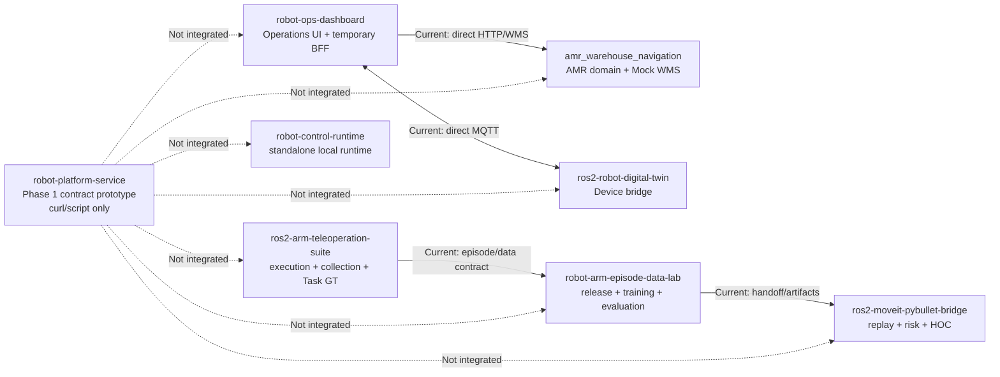
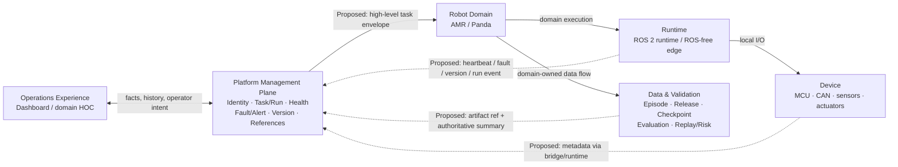
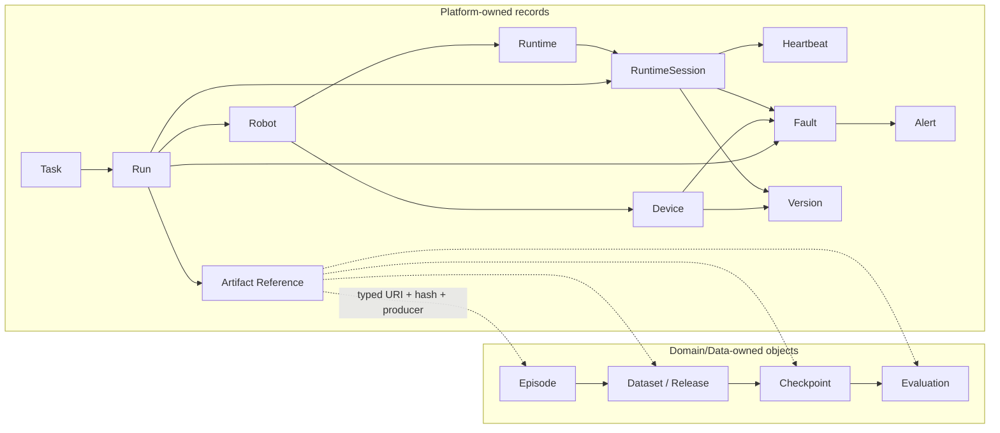

# 八仓机器人作品集统一系统架构

- 状态：Architecture Contract
- 快照日期：2026-08-06
- 适用范围：八个仓库的系统职责、对象权威、集成边界和目标架构

## 1. 架构结论

`robot-platform-service` 的最终定位是：

> 跨机器人域的 Management Plane：统一身份、执行关联、运行状态和证据索引，但不进入控制闭环，也不夺取各领域的事实判定权。

它的不可替代性不来自 Go、SQLite 或 CRUD 数量，而来自它成为唯一能跨域回答以下问题的系统记录面：

- 哪台 Robot 包含哪些 Device；
- 当前运行哪些 Runtime 和软件版本；
- 哪个 Task 产生了哪次 Run；
- Run 期间发生了哪些 Fault；
- 哪些 Alert 需要处理；
- Episode、Checkpoint、Evaluation 和运行证据在哪里；
- 这些结果由哪个仓库、哪个版本、哪个权威来源产生。

Platform 故障时，本地 Runtime 和安全链仍必须安全运行。此时允许丢失全局管理、关联和审计能力，不允许丢失本地控制、安全监督和 fail-closed 能力。

本文件同时描述 Current 与 Proposed。它是职责合同，不是已集成声明。

## 2. 状态词汇

所有仓库总览、README 和架构图统一使用以下状态，避免把目标设计写成当前证据：

| 状态 | 含义 |
|---|---|
| `Current` | 当前代码或现有链路的客观状态 |
| `Verified` | 已由当前仓库代码、测试或可审计运行证据验证 |
| `Mock` | 使用模拟数据或模拟服务，不代表真实生产者 |
| `Reserved` | schema 或接口位置已预留，但能力未开放 |
| `Proposed` | 目标设计，尚未完成实现或接入 |
| `Not integrated` | 两个系统之间当前没有真实数据连接 |

## 3. 按系统职责分层

划分依据不是仓库名称或编程语言，而是三项系统属性：数据速率与实时性、事实权威、故障隔离。

| 系统层 | 核心职责 | 独立原因 |
|---|---|---|
| Operations Experience | 页面、图表、视频、操作员工作流、领域专用 HOC | UI 可替换，不能成为事实源 |
| Platform Management | 全局身份、Task/Run 关联、低频健康、Fault/Alert、版本和产物索引 | 跨域对象只在这里统一 |
| Robot Domain | AMR/Panda 任务语义、规划、执行和 Task GT | 只有领域代码理解“到站”“抓取”“lift”等含义 |
| Runtime | 进程生命周期、线程/fd、watchdog、deadline、状态机、设备监督和本地安全 | 必须低延迟、fail-closed，不能依赖网络平台 |
| Device | MCU、传感器、执行器、固件、总线节点和协议桥 | 面对真实 I/O、电气约束和设备故障 |
| Data & Validation | Episode、Release、Checkpoint、Evaluation、Handoff、Replay、Risk 和证据 | 负责可复现性与结论边界，不参与在线控制 |

### 3.1 仓库主归属

一个仓库可以包含次级适配代码，但每种事实只有一个主权威。

| 仓库 | 主层 | 次级职责或边界 |
|---|---|---|
| `robot-platform-service` | Platform Management | 无 UI；只保存域对象引用，不保存产物本体 |
| `robot-control-runtime` | Runtime | Device 协议适配、Evidence Plane |
| `robot-ops-dashboard` | Operations Experience | 当前包含临时 BFF/集成代理，但不是 Platform |
| `amr_warehouse_navigation` | Robot Domain: AMR | Mock WMS 是 AMR 域任务权威 |
| `ros2-robot-digital-twin` | Device | micro-ROS/ROS 2/MQTT 设备桥 |
| `ros2-arm-teleoperation-suite` | Robot Domain: Panda upstream | 在线 Runtime、设备接口、采集和 Task GT |
| `robot-arm-episode-data-lab` | Data & Validation: Panda midstream | 数据交付、训练和离线 Gate |
| `ros2-moveit-pybullet-bridge` | Data & Validation: Panda downstream | Replay Runtime、Risk 和领域 HOC |

Dashboard 必须独立列为 Operations Experience。否则 Dashboard backend 会与 Platform 争夺 Device、Task、Run、Alert 和 Evaluation 的 canonical ownership。

## 4. Current：当前真实系统

当前 `robot-platform-service` 没有连接其它七仓。Dashboard 直接连接 AMR/Digital Twin、Panda 三仓的文件/产物交接以及独立的 `robot-control-runtime` 都是现有事实；它们不能被目标 Platform 图覆盖。

## 5. Proposed：目标系统

图例：

- 实线是执行流或现有域数据流；
- 虚线是低频管理事件或引用；
- 标有 `Proposed` 的箭头尚未集成；
- 本地安全反馈只在 Domain/Runtime/Device 内闭环，永远不经过 Platform；
- Platform 发出的 Task 是高层、异步、可拒绝的意图，不是 actuator command。

## 6. Platform 应拥有的能力

| 能力 | Platform 的正确角色 |
|---|---|
| Robot Registry | 全局 Robot 身份和类型；不保存 URDF、运动学或任务语义 |
| Device Registry | Robot 下 MCU、传感器、执行器、总线节点等身份与拓扑 |
| Runtime Registry | Runtime instance、部署位置、boot/session、组件版本和管理面状态 |
| Task | 拥有跨域任务信封、Platform ID 和提交历史；Domain 负责校验、接受和执行 |
| Run | 记录 Task 的一次执行尝试，关联 Robot、Runtime、Version 和 Artifact Reference |
| Heartbeat | 保存 Runtime 管理面存活观测；按 runtime instance + boot/session 判定 |
| Fault | 保存来源系统上报的事实投影；来源 Runtime/Domain 才能确认和清除根因 |
| Alert | Platform 派生的运维通知及确认状态；确认 Alert 不等于清除 Fault |
| Version | 记录部署到 Device/Runtime 的软件或固件构建身份和 Git SHA |
| Artifact Reference | 保存类型、URI、hash、producer、version 和 provenance；不保存产物本体 |

最终 Task 权威采用以下合同：

> Dashboard 向 Platform 提交高层 Task intent；Platform 统一 Task/Run ID；AMR/Panda Domain 负责接受、拒绝、执行和最终结果。

Platform 不能自行把 Task 标记为成功，也不能覆盖 Panda Task GT 或 AMR executor 的终态。

## 7. Platform 绝对不能拥有

- CAN、UART、ROS 2 topic、MoveIt、Nav2、PID 或实时命令循环；
- watchdog、deadline、Hold、E-stop、故障恢复和本地安全决策；
- AMR 地图、坐标、costmap、路径规划和 WMS 领域规则；
- Panda observation/action schema、Task GT、训练、Gate 和风险阈值；
- Episode、图像、点云、Checkpoint、Evaluation 报告本体；
- 从 task progress、object pose、risk score 推断 Task Success；
- 高频时序遥测仓库、OTA 刷写、多机器人路径调度；
- Dashboard 页面布局、图表状态、视频代理和 WebSocket 客户端管理。

## 8. 统一对象和权威

### 8.1 对象定义

| 对象 | 定义 | Platform 保存什么 | 事实权威 |
|---|---|---|---|
| Robot | 可被执行任务的 physical 或 simulation 机器人资产 | canonical identity、类型、关系 | Platform 管身份；Domain 管能力语义 |
| Device | Robot 下的 MCU、传感器、执行器、总线节点或设备端点 | identity、Robot 归属、静态拓扑 | Device 层拥有行为和真实 I/O |
| Runtime | 部署到 Robot、可独立管理和观测的软件实例；一次进程启动由 RuntimeSession 表示 | deployment、session、Version 和状态投影 | Runtime 拥有内部状态机 |
| Task | 操作员或系统提交的高层意图 | envelope、Platform ID、提交历史 | Domain 拥有校验、接受和结果 |
| Run | Task 的一次执行尝试 | correlation ledger | Domain 拥有详细 trace 和执行真值 |
| Heartbeat | RuntimeSession 向管理面报告存活的一次观测 | reported/received time 和 liveness projection | Runtime 产生；Platform 计算管理面存活 |
| Fault | Runtime/Device/Domain 检测出的真实异常 | 来源事实的只读投影 | 来源系统确认、更新和清除 |
| Alert | 需要操作员关注的通知 | 规则、状态和 ack 历史 | Platform |
| Artifact | Platform 外部的不可内嵌产物 | 只保存 typed Artifact Reference | Domain/Data 保存本体 |
| Episode | 一次 Panda 数据采集单元 | Artifact Reference | Panda upstream/Data Domain |
| Checkpoint | 训练产物 | Artifact Reference | Panda midstream |
| Evaluation | 对策略、Checkpoint 或 Run 的分层评测 | 权威摘要和 Artifact Reference | 明确的验证 producer |
| Version | 软件、固件、协议或 schema 的构建身份 | deployment inventory、Git SHA | Platform 登记部署；各域拥有协议/schema 语义 |

Platform 的统一原则是：

- 持有 identity、correlation、operational projection；
- 不持有 domain semantics、execution truth、local safety；
- 不搬运 artifact body，只登记可校验引用；
- 每个投影必须保留 source system、producer version 和更新时间。

Robot、Device、Runtime 的身份寿命、字段边界、RuntimeSession 和 Heartbeat 约束已经在 [Robot / Device / Runtime 拆分合同](ROBOT_DEVICE_RUNTIME_CONTRACT.md) 中冻结；八仓候选、blocked 项和明确排除项见 [Registry 对象分类账](REGISTRY_OBJECT_CLASSIFICATION.md)。[D2/D3 一致性审阅](MANAGEMENT_PLANE_V2_CONFORMANCE_REVIEW.md) 已冻结五项语义；[Management Plane v2 本地实现草案](MANAGEMENT_PLANE_V2_DRAFT.md) 的 D2 schema/ID 与 Go verification 已通过，D3 仍为 Fail，也没有真实跨仓接入。因此目标态箭头仍标记为 `Proposed / Not integrated`。

### 8.2 对象关系

## 9. 关键系统边界

### 9.1 Platform 与 Runtime

- Runtime 拥有本地单调时钟、状态机、deadline、设备 heartbeat、CommLoss 和 fail-closed 行为。
- Platform 只接收低频 Runtime heartbeat、状态、Fault、Version 和证据引用。
- CAN `NodeHeartbeat` 与 Platform `RuntimeHeartbeat` 是两类对象，不能共享 seq、session 或 timeout 语义。
- Platform 不得发 OutputCommand、清除 Runtime Fault 或驱动状态机恢复。
- Runtime 不能依赖 Platform 在线才能启动、停车或进入安全状态。

### 9.2 Platform 与 Dashboard

- Platform 是事实与历史 API；Dashboard 是可视化和操作工作流消费者。
- Dashboard 可做 view-model 转换、视频代理和 WebSocket fan-out，但不再拥有 canonical Device/Task/Run/Alert。
- 当前 AMR proxy、MQTT cache 和 motor bench 命令可保留为演示链，必须标为“直接领域适配路径”。
- 低频 motor bench 命令也不迁入 Platform。

### 9.3 Platform 与 Panda 三仓

- `ros2-arm-teleoperation-suite` 继续拥有执行、采集和 Task GT。
- `robot-arm-episode-data-lab` 继续拥有 schema、Release、Checkpoint、Evaluation、Gate 和 Handoff。
- `ros2-moveit-pybullet-bridge` 继续拥有 Replay、Risk、Safety readiness 和领域 HOC。
- Platform 只登记 Run、权威结果来源和 Artifact Reference；三仓文件交接不经 Platform 搬运。
- `Offline Pass != Task Success`，`Replay Complete != Sim2Real`，software Hold/E-stop 也不等于 certified functional safety。

### 9.4 Platform 与 AMR

- Platform Task 保存跨域意图和关联 ID。
- Mock WMS 保存 AMR 任务、目标点、队列、执行状态和终态。
- Platform 可转交带 schema/version 的 AMR opaque payload，但不解析坐标和 Nav2 参数。
- Platform 不调用 `/navigate_to_pose`，不发布 `/cmd_vel`，不判断 localization/readiness。

## 10. 逐仓集成合同

当前七条连接全部是 `Not integrated`。下表定义未来连接的最小边界，不授权立即实现。

| 仓库 | Platform 应读取/接收 | Platform 应暴露 | Platform 不应知道 | Platform 不应控制 |
|---|---|---|---|---|
| `robot-control-runtime` | Runtime instance、boot/session、管理面 heartbeat、状态/Fault、Version、evidence refs | Runtime inventory、liveness、Fault 和 Run 历史；注册与上报合同 | CAN 帧、fd、线程、scheduler 和 deadline 细节 | mailbox、OutputCommand、watchdog、状态恢复、Fault clear |
| `robot-ops-dashboard` | 操作员 Task intent、Alert ack 等请求 | Robot/Device/Runtime、Task/Run、Fault/Alert、Version、Artifact 查询和事件视图 | 页面组件、图表、MJPEG、前端缓存 | UI 状态、MQTT motor command、视频流 |
| `amr_warehouse_navigation` | AMR task 接受/拒绝、domain ID、状态、终态、Fault、run evidence refs | Platform Task/Run ID、Robot/Runtime 上下文、全局查询 | target 坐标、TF、costmap、controller 参数 | Nav2、ready gate、`/navigate_to_pose`、`/cmd_vel` |
| `ros2-robot-digital-twin` | Device/bridge identity、低频健康、Fault、firmware Version、Runtime heartbeat | Robot-Device 拓扑、在线状态、Version 和 Alert 历史 | IMU 样本、四元数、UART 帧、PID/PWM、MQTT topic 细节 | motor command、arm/disarm、PID、E-stop |
| `ros2-arm-teleoperation-suite` | Panda Run 生命周期、Task GT、safety Fault、Episode refs 和运行版本 | Task/Run correlation、Robot/Runtime identity、登记入口 | ROS topic、action tensor、object pose、MoveIt/MuJoCo 参数 | Servo、controller、Recorder、Hold/E-stop、Task GT |
| `robot-arm-episode-data-lab` | Release/Checkpoint/Evaluation/Handoff 的 typed refs、hash、producer status 和 provenance | 跨 Run 产物索引、Version 历史和追溯链接 | schema 内容、训练超参、Gate 阈值、数据文件 | Release、训练、Gate、Evaluation 结论 |
| `ros2-moveit-pybullet-bridge` | Replay Run、risk/fault 摘要、benchmark/risk refs、Task GT 关联 | 下游 Run 历史、Fault/Alert 投影和产物链接 | ROS message、PyBullet state、risk 权重、HOC 内部状态 | PolicyRunner、Risk Engine、Hold/E-stop、Task GT |

## 11. 当前代码的架构判断

当前实现更接近 **Go CRUD Demo**；更准确的名称是 **有正确边界意识的 Platform Contract Prototype**。

已经正确的部分：

- 管理面不进入实时控制；
- 使用统一信封、不统一域内容的方向；
- Device/Heartbeat/Task/Run 有最小持久化和测试；
- 状态判定支持注入时钟；
- SQLite 和单二进制适合当前单机作品集规模；
- 没有过早加入认证、OTA、调度或通用消息总线。

主要缺口按优先级排序：

1. 系统定位与权威关系：Platform 与 Dashboard 的 canonical ownership 尚未在代码合同中体现。
2. 对象关系：当前 `Device` 混合了 Robot、Device 和 Runtime。
3. Runtime/Robot 缺失：Run 无法表达 Robot 通过特定 Runtime/Version 完成一次执行。
4. 来源事实缺失：客户端可直接提交 Task status 和 Run result，无法证明 producer authority。
5. Fault 缺失：只有 reserved Alert 表，没有“source Fault -> operational Alert”。
6. Artifact 太弱：自由字符串缺少 type、URI、hash、producer 和 provenance。
7. Heartbeat 语义不完整：没有 boot/session，也未分开 reported time 与 received time。
8. 接口仍是 CRUD：没有域接受结果、来源事件和跨仓关联合同。
9. README 原先把目标能力和原型能力混在一起；本次文档已拆分 Current/Proposed。

缺口顺序是：

> 系统定位 -> 权威与对象关系 -> 跨仓合同 -> 数据模型 -> API -> README 表达。

因此下一步不是增加 endpoint。

## 12. 表达调整合同

未来修改各仓文档时，应采用以下措辞；本文件不要求现在改动其它七仓代码。

| 位置 | 应调整的表达 |
|---|---|
| Platform README | 区分当前原型与最终目标，使用本仓架构链接 |
| Runtime 总览 | 从七仓升级为八仓，将 Platform 与 Dashboard 分开 |
| Dashboard | 从“统一平台/主入口”收敛为 Operations UI + 当前 direct-integration demo；mock Evaluation 不是事实源 |
| Data Lab | “控制平面”限定为 Panda 域内的数据交付与验证治理面，避免与全局 Platform 混淆 |
| Bridge HOC | 标为 Panda 域专用运行控制台，不是全系统 Dashboard |
| AMR | Mock WMS 是 AMR Domain Task Authority，不是 Platform Scheduler |
| Digital Twin | 标为 Device Layer；高频状态和 motor control 不进入 Platform |
| 所有总览 | 对能力和箭头标注 `Current/Proposed/Verified/Mock/Reserved` |

## 13. 明确不改的部分

- 不合并八个仓库，不建立超级工程或统一构建系统；
- 不改变 Panda 三仓的 Task GT、Release、Evaluation 和 Risk 权威边界；
- 不改变 Runtime 的 ROS-free、fail-closed、SocketCAN 和本地状态机设计；
- 不改变 AMR 的 Nav2/Mock WMS 执行责任；
- 不改变 Digital Twin 的 firmware、micro-ROS/MQTT 和本地安全控制；
- 不删除 Dashboard 现有 AMR、MQTT、视频和 bench 演示链；
- 不因对象模型调整立即重写 Go 代码；当前实现保留为 Phase 1 原型；
- 不引入认证、OTA、多机器人调度、消息总线或更多 reserved CRUD。

## 14. 架构验收口径

本轮只冻结架构，不实施以下功能。未来只有同时满足这些 Gate，仓库才可以从 CRUD 原型称为 Robot Platform Service：

1. Robot、Device、Runtime 三种身份不再混用。
2. Runtime 重启后能以新的 boot/session 正常恢复管理面 heartbeat。
3. Platform Task 能映射到 AMR domain task，终态明确来自 AMR executor。
4. Panda Evaluation 只能登记来源结论，Platform 无法改写 Task GT。
5. Fault 被 Alert 确认后仍保持 active，直到来源系统报告 cleared。
6. Run 能关联 Robot、Runtime、Version 和多个 typed Artifact Reference。
7. Dashboard 的平台视图来自 Platform，不再建立第二套 canonical Task/Device 状态。
8. Platform 离线不影响 Runtime watchdog、Hold/E-stop 或 Device safety chain。

在这些 Gate 之前，停止增加新功能。优先维护系统上下文、对象权威表和 Current-vs-Proposed 的证据边界。
